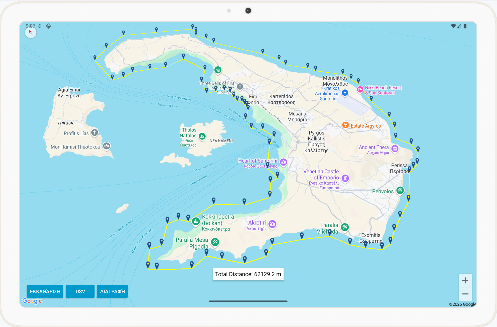
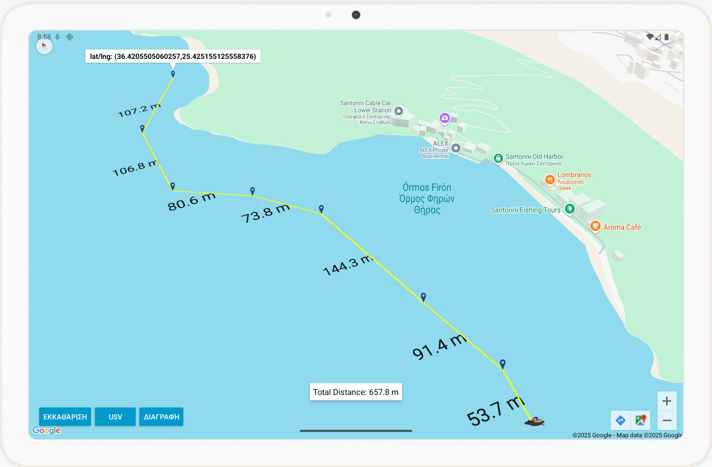
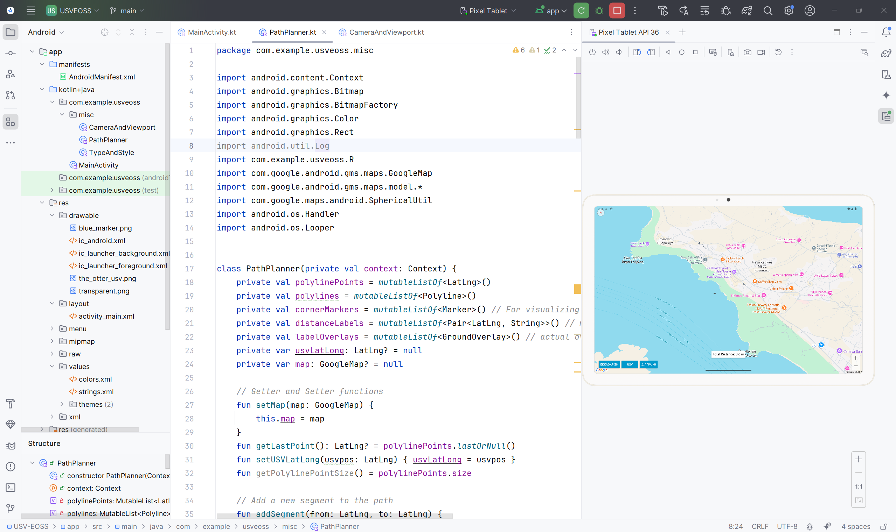

# USV-EOSS: Unmanned Surface Vehicle – Environmental and Oceanic Sensing Software

## Overview
USV-EOSS is an **Android mobile application** developed in **Kotlin** using the **Google Maps SDK**. It serves as a ground control interface for designing and managing mission routes for Unmanned Surface Vehicles (USVs). The application is intended for environmental and seismic monitoring missions, initially focused on the Santorini volcanic region.
> 💡 **Note:** The project has been developed and tested on the **Android Emulator**, not on a physical device. The UI language is Greek, but you can easily modify it to your preferred language by editing the strings.xml file in the res/values folder.


## Purpose
The application provides a user-friendly platform for `remote mission planning`, enabling operators to design safe and efficient paths for USVs operating in marine environments. With this functionality, the application facilitates the systematic monitoring of seismic and volcanic activity in the marine area surrounding Santorini, leveraging technology to support scientific research and civil protection.

## Current Features
At this stage, USV-EOSS offers the following core functionalities:
* **Path Planning**: Users can design routes by adding markers on the map through simple tap interactions.
* **Distance Calculation**: The app computes and displays the distance between each marker as well as the total length of the planned path.
* **Path Editing**: Individual markers can be deleted or repositioned without affecting the rest of the route; full path reset is also supported.
* **Map Constraints**: The map’s zoom levels and panning are restricted to the operational area (Santorini) to ensure mission focus.
* **Dynamic View**: Quick zoom to the initial USV position is provided for user convenience.

## Installation
1️⃣ Clone this repository:
``` bash 
$ git clone https://github.com/michailtam/usv-eoss.git
```
2️⃣ Open the project in Android Studio (version Meerkat or later)

3️⃣ Add your Google Maps API Key to your program **(do not hardcode it in AndroidManifest.xml)** (You must create and obtain a Google Maps API key in the [Google Cloud Console](https://console.cloud.google.com/) before building or running the application) 
> ⚠️ Security tip: For security reasons, store your API key locally (in local.properties add MAPS_API_KEY=<YOUR_API_KEY>).

``` xml
<meta-data
    android:name="com.google.android.geo.API_KEY"
    android:value="${MAPS_API_KEY}" />
```

4️⃣ From Tools select Device Manager, add a **Pixel Tablet 11 inch** device and choose:

* **API**: API 36.0 "Baklava"; Android 16
* **Services**: Google APIs
* **System Image**: Google APIs intel x86_64 Atom System Image (API 36.0)

5️⃣ Build and run the app on a physical device or an Android emulator (recommended: 11-inch tablet profile).

## Future Work
Planned enhancements include:
* Real-time USV tracking 
* Telemetry data visualization 
* Environmental parameter monitoring 
* Alerting capabilities for critical events

## Usage
+ Launch the app on your device.
+ Tap on the map to add markers and define the USV route.
+ View distances between markers and total route length at the bottom of the screen.
+ Use on-screen buttons to delete markers, clear the path, or zoom to the USV’s initial position.
+ The map view is constrained to the Santorini operational area to help focus mission planning.

## Screenshots
| **Mission Path** | **Path Planning** |
|-----------------|-----------------|
|      |      |

| **Google Maps integration in Android Studio** |
|-----------------|
|      |
